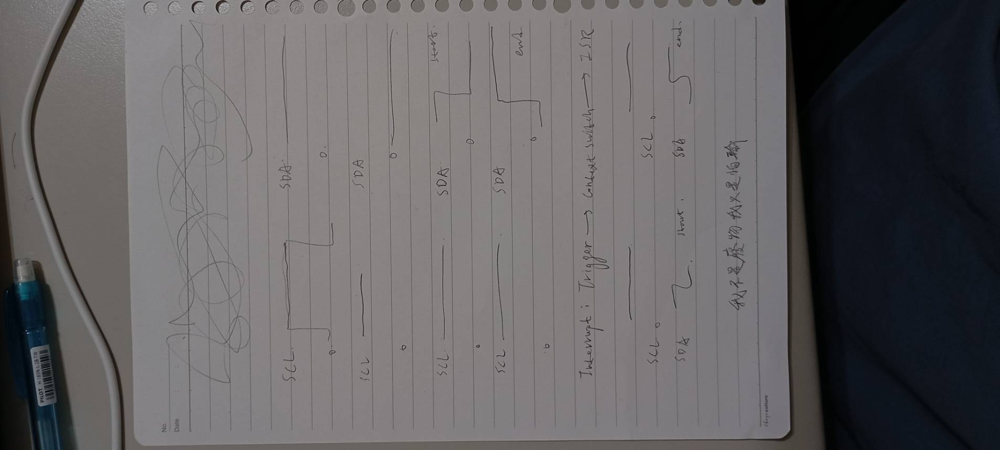

# I2C_Physics_Analysis
A deep dive into I2C protocol through the lens of a Physics Master. This project focuses on Signal Integrity (SI) analysis, RC time constant effects on rise time, and low-level firmware implementation on STM32.
